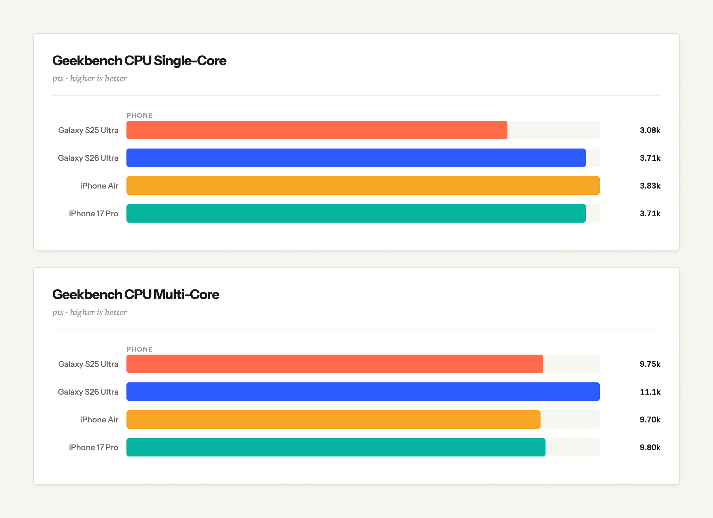

# Benchmark Studio

A single-page benchmark comparison tool. Define any benchmarks, add devices, enter scores, and get instant visual comparisons — no server required.

## Features

- **Custom benchmarks** — name, unit, and higher/lower-is-better toggle
- **Device categories** — optionally group devices (e.g. Phone, Laptop, Desktop)
- **Score matrix** — spreadsheet-style entry, auto-saves on change
- **Bar charts** — grouped by device category, animated, with tooltips
- **Drag to reorder** — both benchmarks and devices
- **Inline rename** — click any name to edit
- **Visibility toggle** — hide/show items from all charts with one click
- **JSON import/export** — save and share your data
- **localStorage persistence** — everything survives a refresh

## Usage

Open `index.html` in a browser. That's it — everything is self-contained in a single file.
